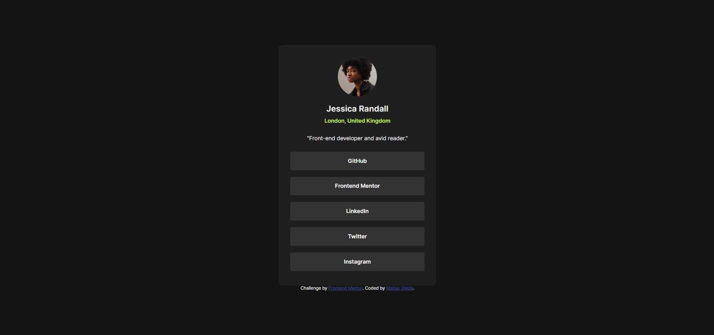

# Frontend Mentor - Social links profile solution

This is a solution to the [Social links profile challenge on Frontend Mentor](https://www.frontendmentor.io/challenges/social-links-profile-UG32l9m6dQ). Frontend Mentor challenges help you improve your coding skills by building realistic projects. 

## Table of contents

- [Overview](#overview)
  - [The challenge](#the-challenge)
  - [Screenshot](#screenshot)
  - [Links](#links)
- [My process](#my-process)
  - [Built with](#built-with)
  - [What I learned](#what-i-learned)
  - [Continued development](#continued-development)
  - [Useful resources](#useful-resources)
- [Author](#author)
- [Acknowledgments](#acknowledgments)

## Overview
Social Links Profile is a challenge in which you have to create a landing page containing links to a person's various social networks.
This landing page is created entirely using HTML5 and CSS3. It is responsive to different screen sizes.

### The challenge

Users should be able to:

- See hover and focus states for all interactive elements on the page

### Screenshot

### Links

- Solution URL: [GitHub repository](https://github.com/sdmatias)
- Live Site URL: [Live site](https://sdmatias.github.io/social-links-profile-main/)

## My process

### Built with

- Semantic HTML5 markup
- CSS custom properties
- Flexbox
- Mobile-first workflow

### What I learned

With this challenge I gained more experience with HTML5 and CSS3.

### Continued development

The next step will be to continue practicing HTML5, CSS3 and soon add JS to my challenges.

## Author

- Website - [Matías](https://github.com/sdmatias)
- Frontend Mentor - [@sdmatias](https://www.frontendmentor.io/profile/sdmatias)
- X - [@sprtdevice](https://www.x.com/sprtdevice)
